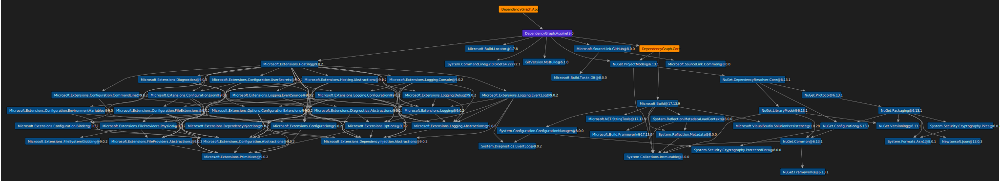

# About

[](https://www.nuget.org/packages/DependencyGraph.App/)

Allows you to create dependency graphs for .NET SDK-style projects. This is the .NET Global Tool allowing usage of dependency-graph from the command line. The most notable difference to other tools providing such functionality is that dependency-graph also includes transitive dependencies, thus creating a complete dependency graph.

## Usage

### Installation

```powershell
dotnet tool install --global DependencyGraph.App
```

### Print dependencies to the console

After installation, the tool can be called with the command `dependency-graph`. Per default, dotnet-dependecy-graph will look for a project file in the current directory, restore the project and print its dependencies to the console. For example, the call of

```powershell
dependency-graph
```

for the project `DependencyGraph.App` will print the following output to the console

```
DependencyGraph.App
   net8.0
      DependencyGraph.Core
         NuGet.ProjectModel@6.8.0
            NuGet.DependencyResolver.Core@6.8.0
               NuGet.Configuration@6.8.0
                  NuGet.Common@6.8.0
                     NuGet.Frameworks@6.8.0
                  System.Security.Cryptography.ProtectedData@4.4.0
               NuGet.LibraryModel@6.8.0
                  NuGet.Common@6.8.0
                     NuGet.Frameworks@6.8.0
                  NuGet.Versioning@6.8.0
               NuGet.Protocol@6.8.0
                  NuGet.Packaging@6.8.0
                     Newtonsoft.Json@13.0.3
                     NuGet.Configuration@6.8.0
                        NuGet.Common@6.8.0
                           NuGet.Frameworks@6.8.0
                        System.Security.Cryptography.ProtectedData@4.4.0
                     NuGet.Versioning@6.8.0
                     System.Security.Cryptography.Pkcs@6.0.4
                        System.Formats.Asn1@6.0.0
      GitVersion.MsBuild@5.12.0
      Microsoft.Extensions.Hosting@8.0.0
...
```

You can also explicitly specify a project file:

```powershell
dependency-graph .\DependencyGraph.App\DependencyGraph.App.csproj
```

### Use the DGML visualizer

Printing large dependency graphs to the console can be hard to comprehend. A better option may be to use the DGML visualizer. It creates a DGML file that can be viewed in Visual Studios DGML viewer. To use the DGML visualizer use the `-v dgml` or `--visualizer dgml` option. In this case, you must also specify an output file. The command

```powershell
dependency-graph .\DependencyGraph.App\DependencyGraph.App.csproj -v dgml -o DependencyGraph.App.dgml
```

creates a dependency graph for the `DependencyGraph.App` project and writes it to the file `DependencyGraph.App.dgml`. The result may look like the following image:



### Exclude dependencies

Sometimes dependency graphs can get quite big and confusing. With the option `-e` or `--exclude` you can exclude dependencies from being added to the resulting dependency graph. For example, the command

```powershell
dependency-graph -e Microsoft.* System.*
```

will exclude all dependencies that start with `Microsoft.` or `System.` from the resulting graph.

### Explicitly include dependencies

Another possibility to create smaller and clearer dependency graphs is to use the `-i` or `--include` option. It allows to specify patterns for dependencies that should be included in the graph. All other dependencies will be omitted. For example, if you want to find out your dependencies on packages from your company, you can use the following command:

```powershell
dependency-graph -i YourCompany.*
```

### Limit graph depth

You can limit the graph depth by specifying the option `-d` or `--max-depth`. For example, the command

```powershell
dependency-graph -d 2
```

will limit the depth of the resulting graph to 2.

### Show help

```powershell
dependency-graph -h
```
